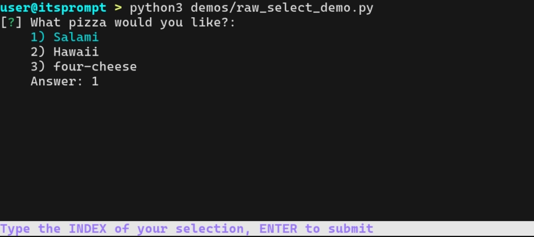
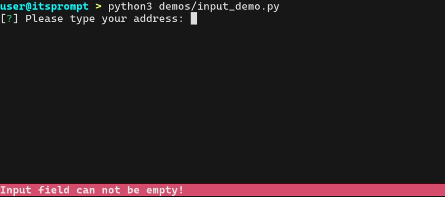

Prompt Types in ItsPrompt
=========================

The following prompt types are available in ItsPrompt:

.. contents:: Available Prompt Types
   :local:
   :depth: 2

select
------

.. code-block:: python

    ans = Prompt.select(
        question='What food would you like?',
        options=(Separator('The veggies'), 'Salad', Separator('The meaties'), 'Pizza', 'Burger'),
        default='Pizza',
    )
    
To read more about the parameters of the `select` prompt, see the definition of :meth:`~ItsPrompt.prompt.Prompt.select`.

raw_select
----------

.. code-block:: python

    ans = Prompt.raw_select(
        question='What pizza would you like?',
        options=('Salami', 'Hawaii', 'four-cheese'),
        allow_keyboard=True,
    )

To read more about the parameters of the `raw_select` prompt, see the definition of :meth:`~ItsPrompt.prompt.Prompt.raw_select`.

expand
------

.. code-block:: python

    ans = Prompt.expand(
        question='Where do you want your food to be delivered?',
        options=('my home', 'another home'),
        allow_keyboard=True,
    )
    
To read more about the parameters of the `expand` prompt, see the definition of :meth:`~ItsPrompt.prompt.Prompt.expand`.

checkbox
--------

.. code-block:: python

    ans = Prompt.checkbox(
        question='What beverages would you like?',
        options=('Coke', 'Water', 'Juice'),
        default_checked=('Water',),
        disabled=("Coke",),
        min_selections=1,
    )
    
To read more about the parameters of the `checkbox` prompt, see the definition of :meth:`~ItsPrompt.prompt.Prompt.checkbox`.

confirm
-------

.. code-block:: python

    ans = Prompt.confirm(
        question='Is the information correct?',
        default=True,
    )
    
To read more about the parameters of the `confirm` prompt, see the definition of :meth:`~ItsPrompt.prompt.Prompt.confirm`.

input
-----

.. code-block:: python

    ans = Prompt.input(
        question='Please type your name',
        validate=input_not_empty,
    )
    
To read more about the parameters of the `input` prompt, see the definition of :meth:`~ItsPrompt.prompt.Prompt.input`.

.. _prompt_types_table:

table
-----

.. code-block:: python

    data = DataFrame({
        'Food': ['Pizza', 'Burger', 'Salad'],
        'Qty': [1, 0, 0],
    })

    ans = Prompt.table(
        question='Please fill in your quantity',
        data=data,
    )
    
To read more about the parameters of the `table` prompt, see the definition of :meth:`~ItsPrompt.prompt.Prompt.table`.
