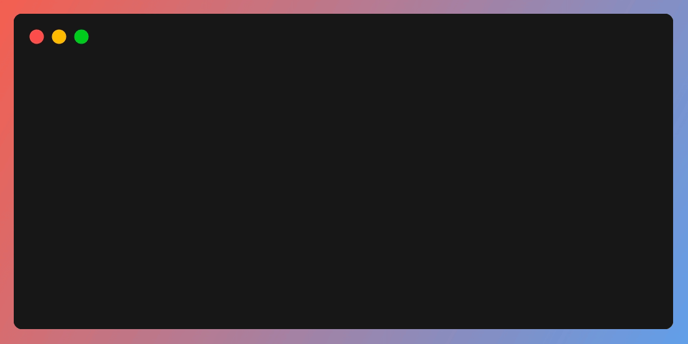

.. main page of ItsPrompt documentation

Welcome to ItsPrompt's Documentation!
=====================================

`ItsPrompt` is an easy-to-use module for managing prompts for the user. It allows you to ask the user for input in a fancy
way, taking care of the problem of user input so you can focus on creating a great program. 

`ItsPrompt` offers many prompt types such as select, raw_select, expand, checkbox, confirm, input, and table. It also 
provides prompt autocompletion and validation, customizable style with `prompt_toolkit`, and a helpful toolbar with 
error messages. 

This documentation will guide you through the features and usage of `ItsPrompt`, helping you to integrate it into your 
projects seamlessly. 

Enjoy exploring `ItsPrompt`!

Getting Started
===============

To get started with `ItsPrompt`, follow the instructions in the :doc:`Getting Started Guide <guide/getting_started>`.

Table of Contents
=================

.. toctree::
   :maxdepth: 2
   :caption: Guides:

   guide/getting_started
   guide/usage
   guide/prompt_types
   guide/options_and_data
   guide/styling

.. toctree::
    :maxdepth: 3
    :caption: API Documentation:
    
    api/prompt
    api/objects

.. toctree::
    :maxdepth: 2
    :caption: Development Guide:

    development_guide/getting_started
    development_guide/documentation
